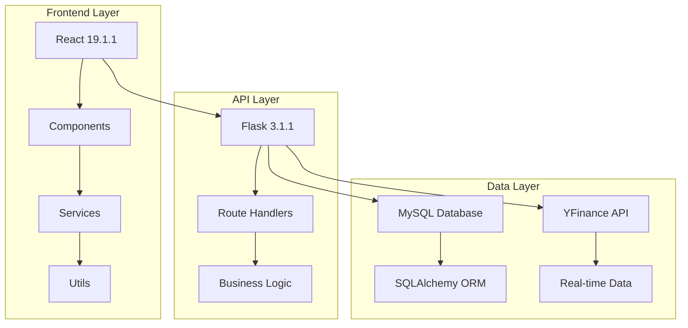

# Portfolio Manager 2025

<div align="center">


**Modern AI-Powered Portfolio Management Platform**

*Real-time stock tracking • AI-driven insights • Enterprise-ready architecture*

[🏃‍♂️ Quick Start](#-quick-start) • [Features](#features) • [Architecture Overview](#architecture-overview) • [🔧 API Documentation](#-api-documentation)

</div>

---

## Overview

Portfolio Manager 2025 is a cutting-edge investment management platform that combines real-time market data, AI-powered analytics, and modern web technologies to deliver a professional-grade portfolio management experience.

### Key Highlights

- AI-Powered Insights - Smart portfolio analysis and investment recommendations
- Real-Time Data - Live market data integration with YFinance
- High Performance - React virtualization and intelligent caching
- Modern UI/UX - Glassmorphism design with responsive layout
- Enterprise Ready - Scalable architecture with robust error handling

---

## Technology Stack

<div align="center">

### Frontend Technologies
<p>
  
  
  
  
</p>

### Backend Technologies
<p>
  
  
  
  
</p>

### Development & Tools
<p>
  
  
  
  
</p>

</div>

---

## Architecture Overview

### System Architecture



### Architecture Layers (Text View)

```
┌─────────────────────────────────────────────────────────────┐
│                    FRONTEND LAYER                           │
│  ┌─────────────┐  ┌─────────────┐  ┌─────────────────────┐  │
│  │ React 19.1.1│  │ Components  │  │ Services & Utils    │  │
│  │ + Vite      │  │ (UI/UX)     │  │ (API + Helpers)     │  │
│  └─────────────┘  └─────────────┘  └─────────────────────┘  │
└─────────────────────────┬───────────────────────────────────┘
                          │ HTTP/REST API
┌─────────────────────────┼───────────────────────────────────┐
│                    API LAYER                                │
│  ┌─────────────┐  ┌─────────────┐  ┌─────────────────────┐  │
│  │ Flask 3.1.1 │  │Route Handler│  │ Business Logic      │  │
│  │ + RESTful   │  │ (Endpoints) │  │ (Portfolio/Trading) │  │
│  └─────────────┘  └─────────────┘  └─────────────────────┘  │
└─────────────────────────┬───────────────────────────────────┘
                          │ Database Queries
┌─────────────────────────┼───────────────────────────────────┐
│                    DATA LAYER                               │
│  ┌─────────────┐  ┌─────────────┐  ┌─────────────────────┐  │
│  │MySQL Database│ │SQLAlchemy ORM│ │ YFinance API        │  │
│  │(Portfolios) │  │ (Models)    │  │ (Live Market Data)  │  │
│  └─────────────┘  └─────────────┘  └─────────────────────┘  │
└─────────────────────────────────────────────────────────────┘
```

### Data Flow

1. **User Interaction** → React Components
2. **API Calls** → Axios Service Layer
3. **Backend Processing** → Flask Route Handlers
4. **Database Operations** → SQLAlchemy ORM
5. **Real-time Updates** → WebSocket/Polling
6. **State Management** → React Hooks
7. **UI Re-render** → Optimized Updates

---

## Application Components

### Core Components

| Component | Purpose | Technologies |
|-----------|---------|-------------|
| **App.jsx** | Root component, state management | React Hooks, Context |
| **Header.jsx** | Navigation, search, AI toggle | Lucide Icons, TailwindCSS |
| **StockTicker.jsx** | Real-time market data display | React Marquee, API Integration |
| **Overview.jsx** | Dashboard with portfolio summary | AI Insights, Metrics Calculation |
| **Portfolio.jsx** | Holdings management & trading | Real-time Data, CRUD Operations |
| **Analytics.jsx** | Performance charts & analysis | Data Visualization, Statistics |
| **BrowseStocks.jsx** | Stock discovery & research | React Window, Progressive Loading |
| **AIInsights.jsx** | AI-powered recommendations | Machine Learning, Context Analysis |
| **AIAssistant.jsx** | Interactive chat interface | NLP, Contextual Responses |
| **StockFlyout.jsx** | Detailed stock information | Real-time Pricing, Trading Interface |

### AI & Analytics Components

```typescript
// AI Insights Generation Flow
Portfolio Data → calculatePortfolioMetrics() → generateAIInsights() 
    ↓
Analysis Algorithms:
├── Performance Calculation
├── Risk Assessment  
├── Diversification Analysis
└── Top Performer Identification
    ↓
Formatted Insights → AIInsights Component → User Interface
```

### Performance Components

- **React Virtualization** - Handles 10,000+ stocks efficiently
- **Intelligent Caching** - 5-minute TTL with auto-cleanup
- **Progressive Loading** - Batch processing for optimal UX
- **Debounced Search** - 300ms delay to reduce API calls

---

## Features

### Portfolio Management
- **Real-time Holdings** - Live portfolio tracking with instant updates
- **Performance Metrics** - Comprehensive gain/loss analysis
- **Risk Assessment** - Volatility and concentration measurements
- **Trade Execution** - Buy/sell functionality with validation

### Stock Discovery
- **Market Data** - Real-time pricing and volume information
- **Technical Analysis** - Key metrics and performance indicators
- **Watchlist Management** - Track stocks of interest

### AI-Powered Insights
- **Portfolio Analysis** - Automated health scoring
- **Risk Evaluation** - Intelligent risk profiling
- **Diversification Advice** - Optimization recommendations
- **Performance Tracking** - Top/worst performer identification

### Analytics Dashboard
- **Performance Charts** - Visual portfolio trends
- **Sector Allocation** - Diversification breakdown
- **Historical Analysis** - Time-series performance data
- **Risk Metrics** - Volatility and correlation analysis

---

## 🏃‍♂️ Quick Start

### Prerequisites

- **Node.js** 18+ and npm
- **Python** 3.11+
- **MySQL** 8.0+
- **Git** for version control

### Installation

1. **Clone the repository**
```bash
git clone https://github.com/ViniMacedo/portfolio_manager_team_11.git
cd portfolio_manager_team_11
```

2. **Setup Backend**
```bash
cd backend
pip install -r requirements.txt
cp .env.example .env
# Configure your database credentials in .env
python init_db.py
python run.py
```

3. **Setup Frontend**
```bash
cd ../frontend
npm install
cp .env.example .env
# Configure API endpoints in .env
npm run dev
```

4. **Access the Application**
- Frontend: http://localhost:3000
- Backend API: http://localhost:5000

---

## 🗂️ Project Structure

```
portfolio_manager_team_11/
├── 📁 frontend/                 # React application
│   ├── 📁 src/
│   │   ├── 📁 components/       # React components
│   │   │   ├── Overview.jsx     # Dashboard component
│   │   │   ├── Portfolio.jsx    # Holdings management
│   │   │   ├── BrowseStocks.jsx # Stock discovery
│   │   │   ├── AIInsights.jsx   # AI recommendations
│   │   │   └── ...
│   │   ├── 📁 services/         # API services
│   │   │   └── api.js           # Axios configuration
│   │   ├── 📁 utils/            # Utility functions
│   │   │   ├── globalUtils.js   # Portfolio calculations
│   │   │   └── aiInsights.js    # AI generation logic
│   │   └── 📁 styles/           # CSS files
│   │       ├── portfolio-2025.css
│   │       └── glassmorphism.css
│   ├── package.json
│   └── vite.config.js
├── 📁 backend/                  # Flask application
    ├── 📁 app/
    │   ├── 📁 api/              # API endpoints
    │   │   ├── portfolio.py     # Portfolio routes
    │   │   ├── quote.py         # Stock data routes
    │   │   ├── transaction.py   # Trading routes
    │   │   └── user.py          # User management
    │   ├── models.py            # Database models

    │   └── config.py            # App configuration
    ├── run.py                   # Application entry point
    ├── init_db.py               # Database initialization
    └── requirements.txt

```

---

## 🔧 API Documentation

### Backend Endpoints (Flask-RESTful)

| Method | Endpoint | Purpose | Parameters | Response |
|--------|----------|---------|------------|----------|
| `GET` | `/api/portfolio/<int:portfolio_id>` | Get portfolio with holdings & live prices | portfolio_id | Portfolio object with holdings array |
| `POST` | `/api/portfolio` | Create new portfolio | name (required) | Created portfolio with ID |
| `GET` | `/api/user/<int:user_id>` | Get user info & balance | user_id | User object with balance |
| `GET` | `/api/quote/<string:ticker>` | Get stock quote, chart data, fundamentals | ticker symbol | Quote with price, chart, volume, sector |
| `GET` | `/api/symbol-search?q=<query>` | Search stocks by symbol/name | q (query string) | Array of matching symbols |
| `POST` | `/api/transaction` | Execute buy/sell transaction | user_id, portfolio_id, product_symbol, qty, price, action | Transaction confirmation |

### Frontend API Client (services/api.js)

**Core Functions:**
- `fetchPortfolioById(portfolioId)` → Portfolio + holdings with live prices
- `fetchUserById(userId)` → User info + balance  
- `fetchStockBySymbol(symbol)` → Quote + chart + fundamentals
- `tradeStock(userId, portfolioId, symbol, qty, price, action)` → Execute trade
- `searchSymbols(query)` → Symbol search results

**Performance Functions:**
- `searchSymbolsPaged()` → Paginated search with cursor
- `discoverSymbolsPaged()` → Discovery feed (fallback: merged searches)  
- `fetchQuotesBatch()` → Batch quotes (fallback: individual calls)

**Component Usage:**
- **App.jsx** - Portfolio/user initialization
- **StockFlyout.jsx** - Trading, quote details  
- **BrowseStocks.jsx** - Search, discovery, batch quotes
- **StockTicker.jsx** - Live price updates

### API Response Examples

**Portfolio Data:**
```json
{
  "id": 1,
  "name": "My Portfolio",
  "created_at": "2025-01-01T00:00:00",
  "holdings": [
    {
      "product_symbol": "AAPL",
      "qty": 10,
      "avg_price": 150.00,
      "current_price": 155.50
    }
  ]
}
```

**Stock Quote:**
```json
{
  "symbol": "AAPL",
  "name": "Apple Inc.",
  "price": 155.50,
  "change": 2.15,
  "sector": "Technology",
  "marketCap": "$2.5T",
  "chart_prices": [150.1, 151.2, 155.5]
}
```

**Transaction Request:**
```json
{
  "user_id": 1,
  "portfolio_id": 1,
  "product_symbol": "AAPL",
  "qty": 10,
  "price": 155.50,
  "action": "BUY"
}
```

---

## 🎨 UI/UX Design

### Design Philosophy

**User-Centric Trading Experience**

Portfolio Manager 2025 is intentionally designed to be **less intimidating** for regular users compared to traditional corporate trading platforms. Our design philosophy prioritizes:

- **Simplified Interface** - Clean, uncluttered layouts that don't overwhelm new traders
- **Intuitive Navigation** - Natural user flows that feel familiar to everyday consumers  
- **Visual Clarity** - Clear data presentation without excessive financial jargon
- **Friendly Interactions** - Approachable micro-animations and helpful guidance
- **Educational Context** - Built-in explanations and insights to build user confidence

Unlike intimidating corporate platforms with complex interfaces and industry terminology, our design makes stock trading accessible to everyone, from beginners to experienced investors.

### Design System
- **Glassmorphism Effects** - Modern translucent interfaces
- **Responsive Design** - Mobile-first approach
- **Dark Theme** - Professional financial application aesthetic
- **Micro-interactions** - Smooth animations and transitions

### Color Palette
```css
:root {
  --color-primary: #6366f1;      /* Indigo */
  --color-success: #10b981;      /* Emerald */
  --color-warning: #f59e0b;      /* Amber */
  --color-danger: #ef4444;       /* Red */
  --color-background: #0f172a;   /* Slate 900 */
  --color-surface: #1e293b;      /* Slate 800 */
}
```

---

## DB Diagram


## Presentation link
[Slides](https://www.canva.com/design/DAGvfqILxII/kpHVmkCWh0tH1WhwBNyDbQ/edit)

---

## 📄 License & Academic Context

This project is an **educational portfolio** developed as part of the **Nueda Academy** program by students currently working.

**Academic Project - Team 11**

- **Institution**: Nueda Academy
- **Context**: Educational technology development program
- **Industry Partnership**
- **Year**: 2025

This project demonstrates modern full-stack development capabilities and serves as a learning exercise in financial technology applications. All code and documentation are for educational and demonstration purposes.

For licensing inquiries or commercial use, please contact the development team or academic institution.

---

<div align="center">

**Built with ❤️ by Team 11**

*Portfolio Manager 2025 - Where Technology Meets Investment Excellence*

</div>
