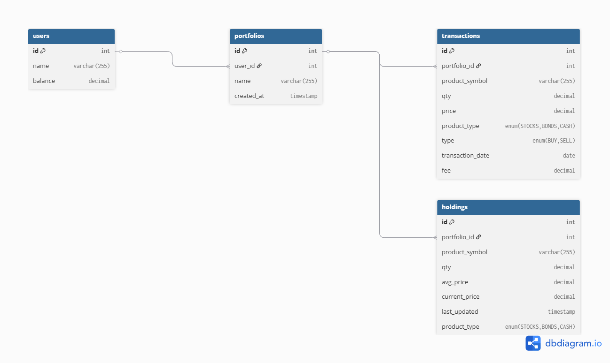

# Portfolio Manager Team 11

This is the final project of CS Foundation provided by Neueda and sponsored by Morgan Stanley.
Based on: https://bitbucket.org/neuedamats/portfoliomanager/src/master/

Requirements: Python 3.8+, Node.js

Backend (Windows):

```
cd backend
python -m venv venv
venv\Scripts\activate
pip install -r requirements.txt
python run.py
```

Backend (Linux/Mac):

```
cd backend
python -m venv venv
source venv/bin/activate
pip install -r requirements.txt
python run.py
```

Frontend:

```
cd frontend
npm install
npm run dev
```

http://localhost:5173

You should see a welcome message that confirms the connection with the backend.

## Technology Stack

- Backend:

  - Flask (Web framework)
  - Flask-CORS (Cross-origin resource sharing)

- Frontend:
  - React (UI library)
  - Vite (Build tool)
  - Axios (HTTP client)


## DB Diagram

